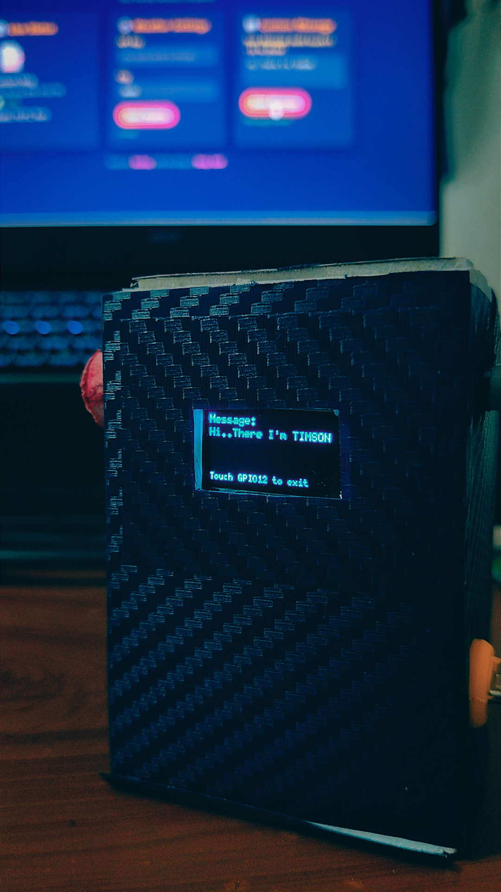
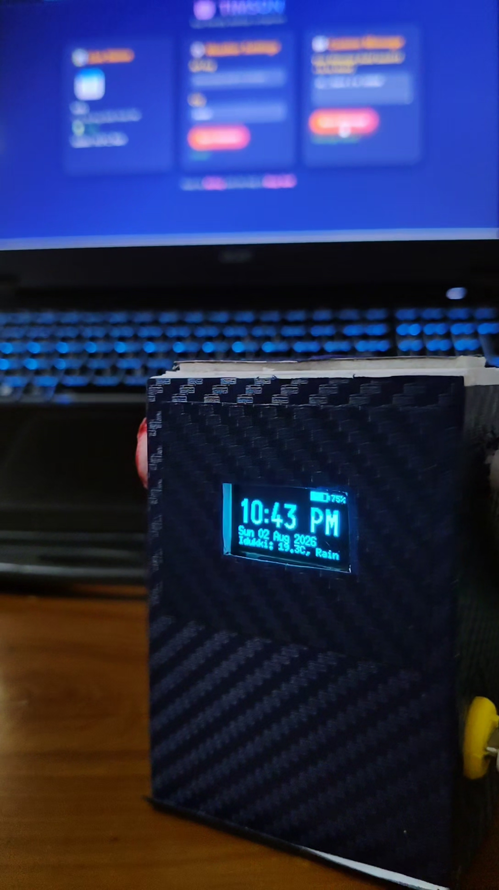
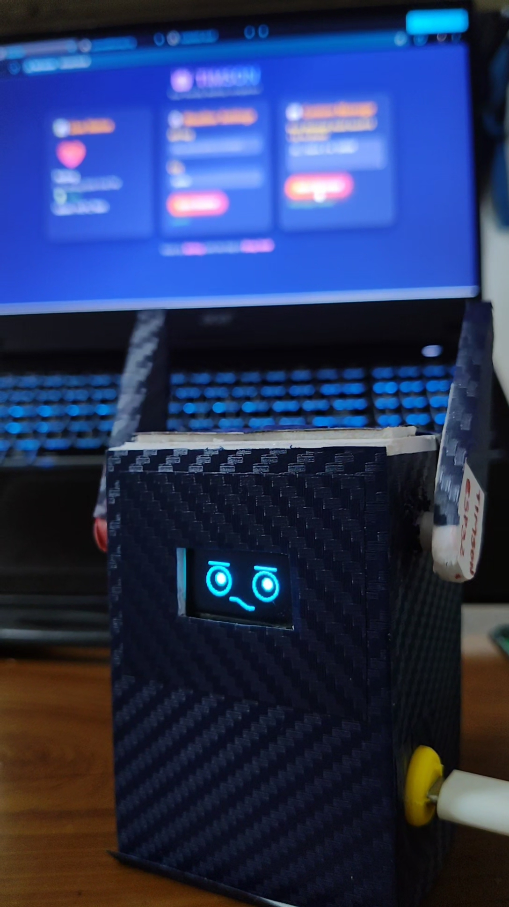
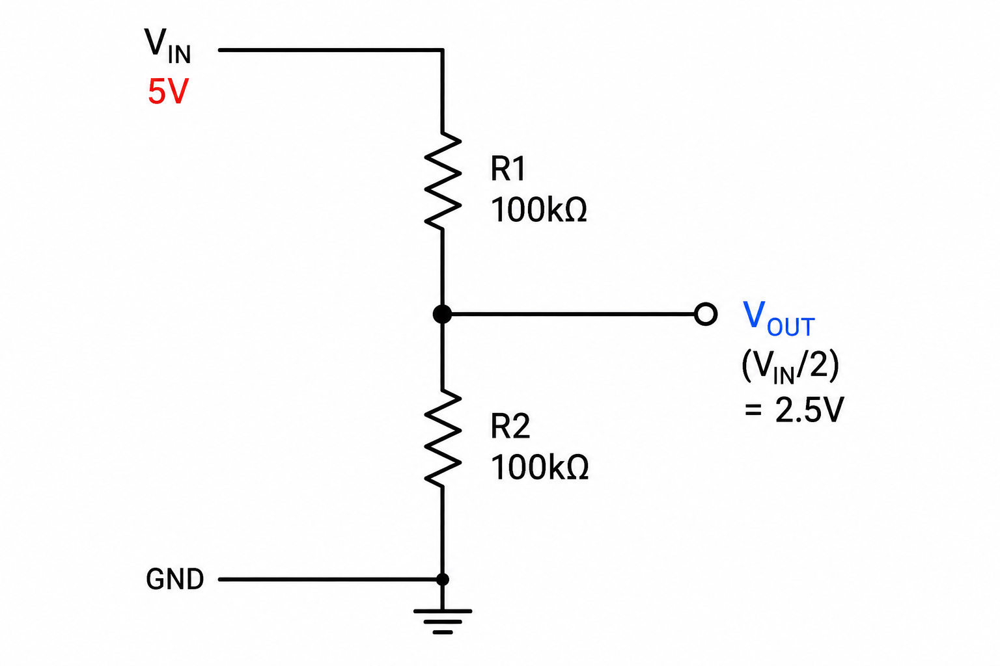
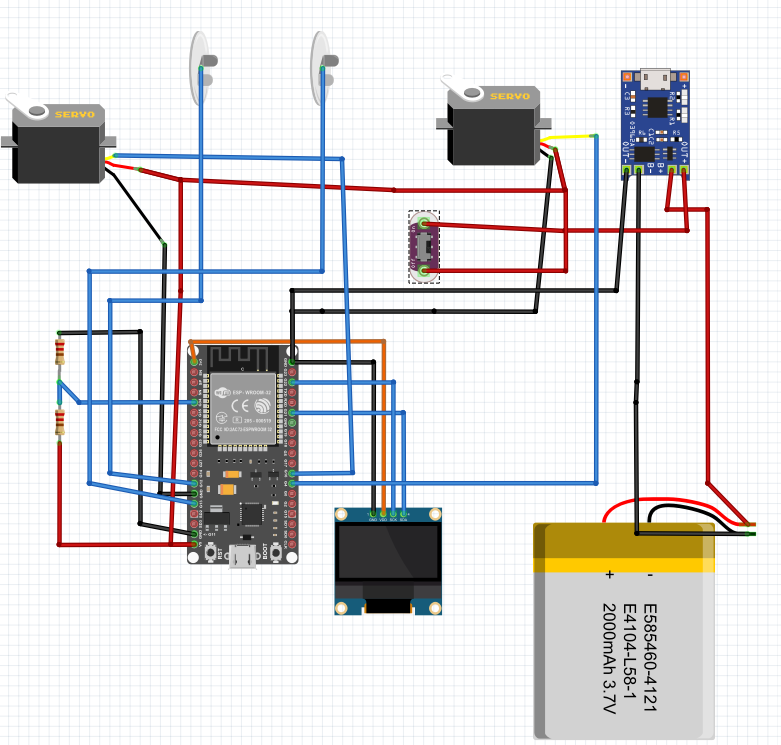
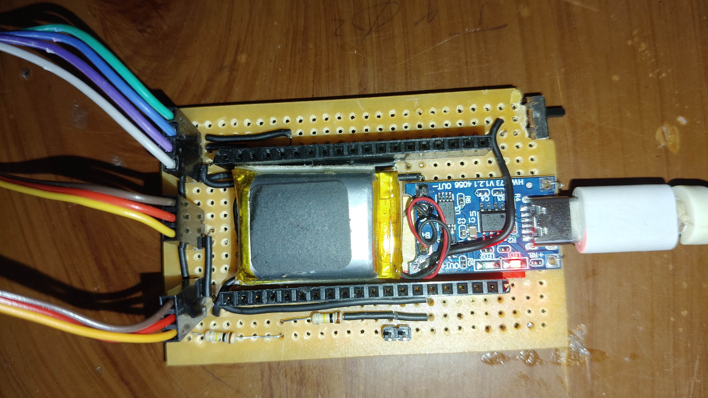

# 🤖 TIMSON – Desktop Pet

  

> A friendly, internet‑connected desktop companion built with ESP32, a 0.96" OLED, two servos, and capacitive touch sensors.
---

## ✨ Features

- 🕒 **Live Clock & Date** – IST time with AM/PM and full date display.
- 🌤 **Weather** – Fetches real‑time weather for your city (OpenWeatherMap).
- 😊 **Animated Expressions** – Happy, sleepy, neutral faces drawn on the OLED.
- ✋ **Touch Interaction**
  - **GPIO12** – short press = info screen, long press = idle, very long press (>10s) = deep sleep.
  - **GPIO13** – short press = petting mode (hands wave), mid press = sleep mode, long press (>3s) = custom message.
- 👐 **Petting Animation** – Servos sweep a wide 130° arc (25°↔155°) with a smooth triangle wave.
- 🛌 **Deep Sleep** – Hold GPIO12 for 10 s to enter deep sleep; touch again to wake. Power draw drops to ~5 µA.
- 💬 **Custom Message** – Set via web dashboard; displayed on OLED after long press.
- 🔋 **Battery Monitoring** – Voltage divider (100k/100k) reads Li‑Po level, shown with a battery icon.
- 🌐 **Web Dashboard** – Vibrant, mobile‑friendly interface at `http://timson.local` to view status, update weather settings, and change the custom message.
- ⚙️ **Wi‑Fi Manager** – Captive portal with password protection for easy credential & API key entry.
- 🔒 **Secure AP** – Configuration portal is password‑protected (`timson123`).

---

## 📸 More Screenshots

| Info Mode | Petting Mode |
|-----------|--------------|
|  |  |

---

## 🔌 Hardware

| Component          | GPIO / Connection |
|--------------------|-------------------|
| OLED 0.96" (I²C)   | SDA → 21, SCL → 22 |
| Right Hand Servo   | GPIO4             |
| Left Hand Servo    | GPIO16            |
| Touch Sensor 1     | GPIO12            |
| Touch Sensor 2     | GPIO13            |
| Battery ADC        | GPIO34 (voltage divider) |
| TP4056 Charger     | BAT+/BAT‑ to Li‑Po, USB‑C for charging |

### Voltage Divider (Battery)

### Overall Circuit diagram

---

## 🖥️ Firmware

The latest firmware is in `Firmware1.3.ino`.  

### Required Libraries
- [WiFiManager](https://github.com/tzapu/WiFiManager) (tzapu)
- [ArduinoJson](https://arduinojson.org/) (Benoit Blanchon)
- [U8g2](https://github.com/olikraus/u8g2) (olikraus)
- [ESP32Servo](https://github.com/madhephaestus/ESP32Servo)

### Upload Settings
- Board: **ESP32 Dev Module**
- Partition Scheme: **Huge APP (3MB No OTA/1MB SPIFFS)**
- Flash Size: 4MB

---

## 🚦 First‑Time Setup

1. Power on TIMSON.  
2. If no saved Wi‑Fi is found, it creates an AP named **TIMSON-AP** (password: `timson123`).  
3. Connect your phone/laptop to that AP and wait for the captive portal (or browse to `192.168.4.1`).  
4. Enter your Wi‑Fi credentials, **OpenWeatherMap API key**, and **city** (e.g. `Idukki,IN`).  
5. Click **Save** – the device will restart and connect to your network.  
6. Open `http://timson.local` in any browser to see the dashboard and adjust settings.

> **Note**: The weather API key and city are stored permanently in flash – you never need to re‑enter them unless you change your Wi‑Fi network.

---

## 🛠️ Customisation

- **Custom Message**: Go to the web dashboard → **✉️ Custom Message** card → type your message and save.  
- **Touch Threshold**: Adjust `TOUCH_THRESHOLD` in the code if touch sensitivity needs tuning (open Serial Monitor at 115200 baud to see raw values).  
- **Servo Sweep**: Modify `PETTING_AMPLITUDE` and `PETTING_ANIM_PERIOD` to change the petting motion.

---

## 🧰 Hardware Development

  

---

## 📜 License

MIT – feel free to modify and share. See `LICENSE` file for details.

*Built with ❤️ for a friendly desk companion*
